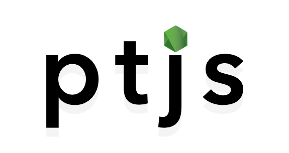

<div align="center">




**Torch and TorchVision, for your Node servers.
Get up and running with PyTorch models within your NodeJS infrastructure in seconds.**

---

<p align="center">
  <a href="#key-features">Key Features</a> •
  <a href="#development">Development</a> •
  <a href="#misc">Misc</a> •
  <a href="#license">License</a>
</p>

[](https://travis-ci.org/github/raghavmecheri/ptjs)
[](https://img.shields.io/codecov/c/github/raghavmecheri/ptjs?style=for-the-badge)
[](https://github.com/raghavmecheri/ptjs/blob/master/LICENSE)

</div>

##### This project is only compatible with models in TorchScript at the moment. Check [this example out](./examples/Exporting.md) to see how you can export your PyTorch model to TorchScript.

---

## The same old PyTorch models, in NodeJS
Run your PyTorch models in Javascript, just like you would in Python.
```js
import { torch, torchvision } from 'ptjs';

const { load } = torch;
const { DataLoader } = torch.utils.data;
const { ImageFolder } = torchvision.datasets;

const { Compose, Resize, InvertAxes } = torchvision.transforms;

const squeezeNet = load("./test/resources/squeezenet_ts.pt");
const transforms = new Compose([
  new Resize({height: 224, width: 224}),
  new InvertAxes()
]);

const loader = new DataLoader(new ImageFolder("./test/resources/dataset"), 1, transforms);
const results = await squeezeNet(loader);
```
Additional examples of both setup and usage involving features like Transforms (in development) and CUDA (in development) may be found [here](./examples).

## Key Features
* Run your PyTorch models in a Javascript environment, without worrying about using Torchscript or custom binaries
* Deploy your model using configurations identical to what you used during training
* Built-in CUDA support
	* CUDA support is a work in progress
* Support for TorchVision, including transforms, dataset classes, and pretrained models
	* Support for TorchVision models is a work in progress

## Development
 * ```yarn install``` should allow you to install project dependancies
 * ```yarn test``` to run the test suite for this project

## Misc
* This project uses [arition's fork of torch-js](https://github.com/arition/torch-js) to run TorchScript - check the project out if you're curious about how we do it!
* Distributed under the MIT license. See [LICENSE](./LICENSE) for more information.
* This project was originally developed as a part of [COMSW4995 - Open Source Development](http://www.cs.columbia.edu/~paine/4995/) at [Columbia University](https://www.columbia.edu/). The original proposal for this project may be found [here](./docs/Proposal.md)
